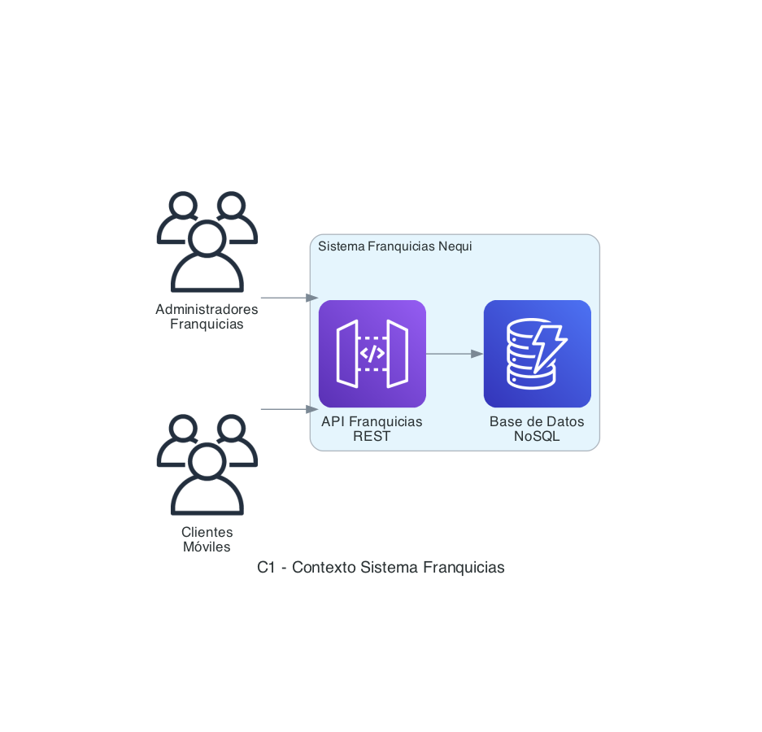
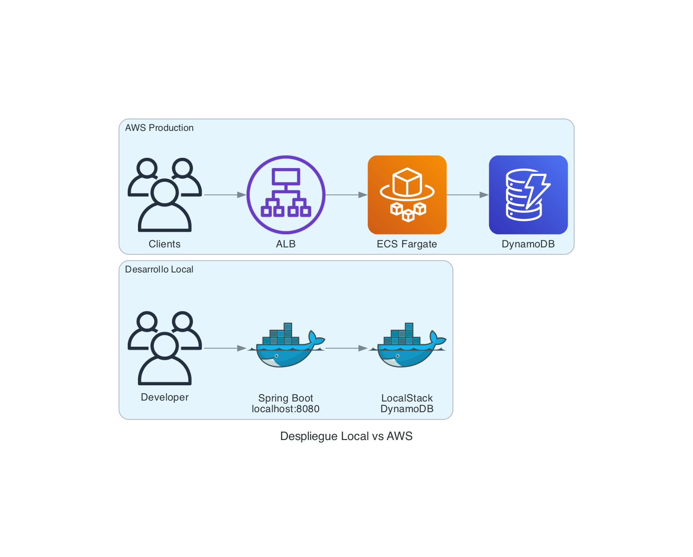

# Sistema de Gestión de Franquicias - Nequi

## Descripción
Microservicio completo para la gestión de franquicias, sucursales y productos, desarrollado como prueba técnica para Nequi. Implementa Clean Architecture con Spring WebFlux, **esquema híbrido DynamoDB** y despliegue en AWS.

## 🚀 Despliegue Local - Guía Completa

### Prerrequisitos
- **Java 25** (obligatorio para Virtual Threads)
- **Docker y Docker Compose** (para LocalStack)
- **Git** (para clonar el repositorio)

### Pasos para Despliegue Local

#### 1. Clonar y Configurar
```bash
# Clonar el repositorio
git clone <repository-url>
cd prueba-tecnica

# Verificar que Docker esté corriendo
docker --version
docker-compose --version
```

#### 2. Iniciar Infraestructura Local
```bash
# Opción A: Con Make (recomendado)
make local-up

# Opción B: Con Docker Compose directamente
docker-compose up -d localstack

# Verificar que LocalStack esté corriendo
docker logs franquicias-localstack

# Verificar que las tablas se crearon correctamente
aws dynamodb list-tables --endpoint-url http://localhost:4566 --region us-east-1
```

#### 3. Ejecutar la Aplicación
```bash
# Opción A: Con Make
make run-local

# Opción B: Con Gradle directamente
cd api
./gradlew bootRun --args='--spring.profiles.active=local'

# Opción C: Con Docker
make docker-up
```

#### 4. Verificar Funcionamiento
```bash
# Health check
curl http://localhost:8080/actuator/health

# Crear una franquicia de prueba
curl -X POST http://localhost:8080/api/franchises \
  -H "Content-Type: application/json" \
  -d '{"name": "Franquicia Test"}'

# Listar franquicias
curl http://localhost:8080/api/franchises
```

### Comandos de Desarrollo

```bash
# Ver todos los comandos disponibles
make help

# Iniciar solo LocalStack
make local-up

# Ejecutar la aplicación
make run-local

# Ver logs de LocalStack
make local-logs

# Ejecutar pruebas
make local-test

# Compilar proyecto
make build

# Iniciar todo en Docker
make docker-up

# Ver estado de servicios
make status

# Limpiar todo
make clean
```

### Configuración Automática

El proyecto incluye **inicialización automática** de DynamoDB:
- ✅ **Script automático**: `scripts/localstack/init-dynamodb.sh`
- ✅ **Tablas pre-configuradas**: Estructura PK+SK compatible con AWS
- ✅ **Sin pasos manuales**: Solo ejecutar `docker-compose up`

### Estructura de Datos Local

La tabla DynamoDB local (`business-franquicias-local`) usa la misma estructura que AWS:
```json
{
  "PK": "FRANCHISE#123e4567-e89b-12d3-a456-426614174000",
  "SK": "METADATA",
  "id": "123e4567-e89b-12d3-a456-426614174000",
  "name": "Franquicia McDonald's",
  "createdAt": "2026-01-12T20:00:00",
  "updatedAt": "2026-01-12T20:00:00"
}
```

### Solución de Problemas

#### LocalStack no inicia
```bash
# Verificar puertos disponibles
lsof -i :4566

# Reiniciar Docker
docker-compose down && docker system prune -f
docker-compose up -d localstack
```

#### Aplicación no conecta a DynamoDB
```bash
# Verificar variables de entorno
echo $AWS_ACCESS_KEY_ID  # debe ser 'test'
echo $AWS_SECRET_ACCESS_KEY  # debe ser 'test'

# Verificar endpoint en application-local.yml
cat api/applications/app-service/src/main/resources/application-local.yml
```

#### Tabla no existe
```bash
# Verificar tablas en LocalStack
aws dynamodb list-tables --endpoint-url http://localhost:4566 --region us-east-1

# Recrear tabla manualmente si es necesario
aws dynamodb describe-table --table-name business-franquicias-local --endpoint-url http://localhost:4566 --region us-east-1
```

#### Problemas con Productos SEPARATED
```bash
# Si las operaciones CRUD fallan en productos separados:
# 1. Verificar que el producto existe
aws dynamodb get-item --table-name business-productos-local \
  --endpoint-url http://localhost:4566 --region us-east-1 \
  --key '{"PK":{"S":"PRODUCT#{product_id}"},"SK":{"S":"METADATA"}}'

# 2. Verificar logs de la aplicación para errores de Enhanced Client
# 3. El sistema usa cliente básico DynamoDB para mayor compatibilidad
```

#### Productos Embebidos con branchId null
```bash
# Problema resuelto en versión actual
# Si persiste, verificar que la aplicación esté actualizada:
curl http://localhost:8080/api/products/{embedded_product_id}
# Debe devolver branchId poblado correctamente
```

## 📚 Documentación Técnica

### [📖 API Documentation](./api/README.md)
- Endpoints completos con ejemplos
- Arquitectura Clean detallada
- Patrones de diseño implementados

## 🏗️ Infrastructure & Deployment

### [🚀 Infrastructure Documentation](./infrastructure/README.md)
- **Backends separados** por ambiente (dev/qa/pdn)
- **Terraform modules** con configuración uniforme
- **GitHub Actions** para CI/CD automatizado
- **Monitoreo** con CloudWatch y métricas

### Comandos Rápidos
```bash
# Desplegar develop
make deploy-dev

# Desplegar QA  
make deploy-qa

# Ver estado de recursos
make status-dev

# Validar configuración
make validate
```

### Entornos Disponibles
- **Development**: Deploy automático desde rama `develop`
- **QA**: Deploy automático desde rama `qa`
- **Production**: Deploy manual desde rama `main` con aprobación

### Recursos AWS por Ambiente
| Recurso | Develop | QA | Producción |
|---------|---------|----|-----------| 
| **ECS Cluster** | `business-cluster-dev` | `business-cluster-qa` | `business-cluster-pdn` |
| **DynamoDB** | `business-*-dev` | `business-*-qa` | `business-*-pdn` |
| **ALB** | `business-franquicias-alb-dev` | `business-franquicias-alb-qa` | `business-franquicias-alb-pdn` |
| **Instancias** | 1 | 1 | 2 |

## 🏛️ Arquitectura

### Vista General del Sistema


### Comparación de Entornos


## 🛠️ Stack Tecnológico

### Backend
- **Java 25** - Virtual Threads, Pattern Matching, Records
- **Spring Boot 3.4** - WebFlux (Programación Reactiva)
- **Clean Architecture** - Hexagonal Architecture
- **DynamoDB Enhanced Client** - AWS SDK v2

### Infraestructura
- **AWS ECS Fargate** - Contenedores serverless
- **AWS Application Load Balancer** - Balanceador de carga
- **AWS DynamoDB** - Base de datos NoSQL
- **Terraform** - Infrastructure as Code
- **LocalStack** - AWS local para desarrollo

### DevOps
- **Docker** - Containerización
- **GitHub Actions** - CI/CD
- **Gradle** - Build automation
- **AWS CLI** - Gestión de recursos

## 🎯 Funcionalidades Implementadas

✅ **Gestión de Franquicias**
- Crear franquicia con validaciones
- Listar todas las franquicias
- Actualizar nombre de franquicia

✅ **Gestión de Sucursales**  
- Crear sucursal en franquicia existente
- Actualizar nombre de sucursal
- Validación de franquicia padre

✅ **Gestión de Productos**
- Crear producto en sucursal
- **Obtener producto individual** (GET /api/products/{id})
- Eliminar producto de sucursal
- Actualizar nombre y stock de producto
- Consultar productos con mayor stock por franquicia
- Consultar producto con mayor stock por sucursal
- **Operaciones CRUD transparentes** en ambas estrategias

✅ **Esquema Híbrido DynamoDB - 100% Funcional**
- **Estrategia EMBEDDED**: Productos <100 embebidos en sucursal
- **Estrategia SEPARATED**: Productos ≥100 en tabla separada
- **Transición automática**: Cambio transparente al alcanzar límite
- **Búsquedas GSI**: Localización eficiente con `findBranchIdByProductId`
- **Cliente básico DynamoDB**: Compatibilidad total con composite keys
- **Validaciones robustas**: Manejo de casos null y errores
- **branchId consistente**: Siempre poblado en respuestas API
- **Monitoreo**: Campo `storageStrategy` indica estrategia actual

## 🧪 Pruebas del Esquema Híbrido

### Script de Prueba Automatizado

Ejecuta el script completo que demuestra el esquema híbrido:

```bash
./test-hybrid-schema.sh
```

Este script:
- Crea 2 franquicias (McDonald's y Subway)
- Crea 4 sucursales (2 por franquicia)
- Crea productos para demostrar ambas estrategias:
  - **EMBEDDED**: Sucursales con <100 productos
  - **SEPARATED**: Sucursales con ≥100 productos
- Verifica el cambio automático de estrategia
- Proporciona comandos para probar las APIs

### Pruebas CRUD Completas

```bash
# Obtener producto (ambas estrategias)
curl http://localhost:8080/api/products/{product_id}

# Actualizar nombre (ambas estrategias)
curl -X PUT http://localhost:8080/api/products/{product_id}/name \
  -H "Content-Type: application/json" \
  -d '{"name": "Nuevo Nombre"}'

# Actualizar stock (ambas estrategias)  
curl -X PUT http://localhost:8080/api/products/{product_id}/stock \
  -H "Content-Type: application/json" \
  -d '{"stock": 100}'

# Eliminar producto (ambas estrategias)
curl -X DELETE http://localhost:8080/api/products/{product_id}
```

**Todas las operaciones devuelven el branchId correctamente poblado.**

### Pruebas Manuales

#### Probar Estrategia EMBEDDED
```bash
# 1. Crear franquicia
curl -X POST http://localhost:8080/api/franchises \
  -H "Content-Type: application/json" \
  -d '{"name": "Test Híbrido"}'

# 2. Crear sucursal
curl -X POST http://localhost:8080/api/franchises/{franchise_id}/branches \
  -H "Content-Type: application/json" \
  -d '{"name": "Sucursal Test"}'

# 3. Crear producto (se embebe en sucursal)
curl -X POST http://localhost:8080/api/franchises/{franchise_id}/branches/{branch_id}/products \
  -H "Content-Type: application/json" \
  -d '{"name": "Producto Embebido", "stock": 50}'

# 4. Verificar estrategia EMBEDDED
aws dynamodb get-item --table-name business-sucursales-local \
  --endpoint-url http://localhost:4566 --region us-east-1 \
  --key '{"PK":{"S":"BRANCH#{branch_id}"},"SK":{"S":"METADATA"}}'
```

### Probar Transición a SEPARATED
```bash
# Script automatizado para probar esquema híbrido completo
./test-hybrid-schema.sh

# Verificar cambio automático a estrategia SEPARATED
# - Productos 1-100: Embebidos en sucursal
# - Producto 101+: En tabla business-productos-local
```

### Verificar Concurrencia
```bash
# Crear múltiples productos simultáneamente
for i in {1..10}; do
  curl -X POST http://localhost:8080/api/franchises/{franchise_id}/branches/{branch_id}/products \
    -H "Content-Type: application/json" \
    -d "{\"name\": \"Producto Concurrente $i\", \"stock\": $i}" &
done
wait

# Verificar que todos los productos se guardaron correctamente
aws dynamodb get-item --table-name business-sucursales-local \
  --endpoint-url http://localhost:4566 --region us-east-1 \
  --key '{"PK":{"S":"BRANCH#{branch_id}"},"SK":{"S":"METADATA"}}' \
  --projection-expression "products" | jq '.Item.products.L | length'
```

## 🔧 Configuración de Desarrollo

### Variables de Entorno Locales
```bash
# Configuración automática en docker-compose.yml
AWS_ACCESS_KEY_ID=test
AWS_SECRET_ACCESS_KEY=test
AWS_REGION=us-east-1
AWS_ENDPOINT=http://localstack:4566
SPRING_PROFILES_ACTIVE=local
```

### Estructura del Proyecto
```
prueba-tecnica/
├── api/                           # Microservicio (Clean Architecture)
│   ├── domain/                    # Lógica de negocio
│   ├── infrastructure/            # Adaptadores (DynamoDB, Web)
│   └── applications/              # Configuración y main
├── infrastructure/                # Terraform (IaC)
│   ├── franquicias/              # Recursos específicos
│   └── transversal_dynamodb/     # Recursos compartidos
├── scripts/                       # Scripts de automatización
│   └── localstack/               # Inicialización automática
├── docs/                         # Documentación arquitectónica
└── docker-compose.yml            # Orquestación local
```

## 🚀 Despliegue en Diferentes Entornos

### Desarrollo Local
```bash
# Inicio rápido (un comando)
make local-up && make run-local

# Verificación
curl http://localhost:8080/actuator/health
```

### AWS (Staging/Production)
```bash
# Configurar backend de Terraform (una sola vez)
./scripts/setup-terraform-backend.sh

# Desplegar infraestructura
cd infrastructure/franquicias/api
terraform init
terraform plan -var-file="env/dev/terraform-dev.tfvars"
terraform apply

# Desplegar aplicación (GitHub Actions automático)
git tag v1.0.0
git push origin v1.0.0
```

## 👨💻 Información del Desarrollador

**Jonathan Alexander Mosquera Ramirez**

---

**🔗 Enlaces de Documentación:**
- [📖 API REST Documentation](./api/README.md)
- [🏗️ Infrastructure & Deployment](./infrastructure/README.md)
- [🎯 Data Model Design](./docs/data-model.md)
