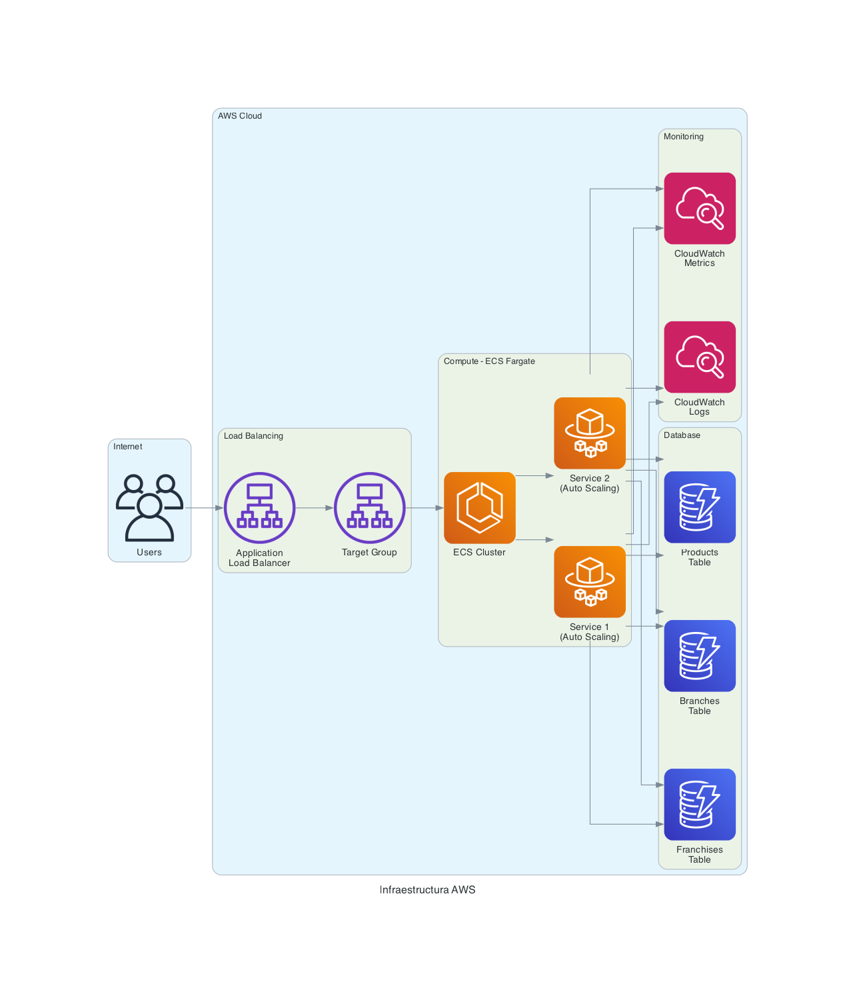

# Infrastructure Documentation

## Descripción
Infraestructura como código para el despliegue del Sistema de Gestión de Franquicias en AWS, utilizando Terraform y GitHub Actions para CI/CD.

## 🏗️ Arquitectura AWS



### Componentes Principales

## 📁 Estructura de Terraform

```
infrastructure/
├── environments/
│   ├── dev/
│   │   ├── main.tf
│   │   ├── variables.tf
│   │   └── terraform.tfvars
│   └── prod/
│       ├── main.tf
│       ├── variables.tf
│       └── terraform.tfvars
├── modules/
│   ├── dynamodb/
│   │   ├── main.tf
│   │   ├── variables.tf
│   │   └── outputs.tf
│   ├── ecs/
│   │   ├── main.tf
│   │   ├── variables.tf
│   │   └── outputs.tf
│   └── networking/
│       ├── main.tf
│       ├── variables.tf
│       └── outputs.tf
└── shared/
    ├── backend.tf
    └── providers.tf
```

## 🚀 Despliegue

### Prerrequisitos
- AWS CLI configurado
- Terraform >= 1.0
- Permisos IAM apropiados

### Variables de Entorno
```bash
export AWS_REGION=us-east-1
export AWS_PROFILE=your-profile
export TF_VAR_environment=dev
```

### Comandos de Despliegue

#### Desarrollo
```bash
cd infrastructure/environments/dev
terraform init
terraform plan
terraform apply
```

#### Producción
```bash
cd infrastructure/environments/prod
terraform init
terraform plan
terraform apply
```

## 🔧 Recursos AWS

### ECS Fargate
- **Cluster:** `franquicias-cluster-{env}`
- **Service:** `franquicias-service-{env}`
- **Task Definition:** Configuración de contenedor
- **Auto Scaling:** Basado en CPU y memoria

### DynamoDB
- **Tablas:**
  - `business-franquicias-{env}`
  - `business-sucursales-{env}`
  - `business-productos-{env}`
- **Billing Mode:** Pay per request
- **GSI:** Optimización de consultas

### Networking
- **VPC:** Red privada virtual
- **Subnets:** Públicas y privadas
- **Security Groups:** Reglas de firewall
- **ALB:** Application Load Balancer

## 🔄 CI/CD Pipeline

### GitHub Actions Workflow

```yaml
name: Deploy to AWS
on:
  push:
    branches: [main, develop]

jobs:
  deploy:
    runs-on: ubuntu-latest
    steps:
      - name: Checkout
        uses: actions/checkout@v3
      
      - name: Configure AWS
        uses: aws-actions/configure-aws-credentials@v2
        with:
          aws-access-key-id: ${{ secrets.AWS_ACCESS_KEY_ID }}
          aws-secret-access-key: ${{ secrets.AWS_SECRET_ACCESS_KEY }}
          aws-region: us-east-1
      
      - name: Build and Push Docker
        run: |
          docker build -t franquicias-api .
          docker tag franquicias-api:latest $ECR_REGISTRY/franquicias-api:latest
          docker push $ECR_REGISTRY/franquicias-api:latest
      
      - name: Deploy to ECS
        run: |
          aws ecs update-service --cluster franquicias-cluster --service franquicias-service --force-new-deployment
```

### Ambientes

| Ambiente | Branch | URL |
|----------|--------|-----|
| Development | `develop` | `https://dev-api.franquicias.com` |
| Production | `main` | `https://api.franquicias.com` |

## 📊 Monitoreo

### CloudWatch
- **Logs:** Agregación de logs de aplicación
- **Metrics:** CPU, memoria, requests
- **Alarms:** Alertas automáticas

### Métricas Clave
- Response time
- Error rate
- Throughput
- DynamoDB consumed capacity

## 🔒 Seguridad

### IAM Roles
- **ECS Task Role:** Permisos mínimos para DynamoDB
- **ECS Execution Role:** Permisos para ECR y CloudWatch

### Security Groups
- **ALB:** Puerto 80/443 desde Internet
- **ECS:** Puerto 8080 desde ALB únicamente
- **DynamoDB:** Acceso desde ECS únicamente

### Secrets Management
- **AWS Secrets Manager:** Credenciales sensibles
- **Parameter Store:** Configuración de aplicación

## 💰 Costos Estimados

### Desarrollo
- **ECS Fargate:** ~$20/mes
- **DynamoDB:** ~$5/mes
- **ALB:** ~$20/mes
- **Total:** ~$45/mes

### Producción
- **ECS Fargate:** ~$100/mes
- **DynamoDB:** ~$25/mes
- **ALB:** ~$20/mes
- **Total:** ~$145/mes

## 🛠️ Comandos Útiles

### Terraform
```bash
# Validar configuración
terraform validate

# Ver plan de cambios
terraform plan

# Aplicar cambios
terraform apply

# Destruir infraestructura
terraform destroy
```

### AWS CLI
```bash
# Ver servicios ECS
aws ecs list-services --cluster franquicias-cluster

# Ver logs
aws logs tail /ecs/franquicias-api --follow

# Escalar servicio
aws ecs update-service --cluster franquicias-cluster --service franquicias-service --desired-count 2
```

## 🔧 Troubleshooting

### Problemas Comunes

#### ECS Task no inicia
```bash
# Verificar logs
aws logs describe-log-groups --log-group-name-prefix /ecs/franquicias

# Verificar task definition
aws ecs describe-task-definition --task-definition franquicias-api
```

#### DynamoDB Access Denied
```bash
# Verificar IAM role
aws iam get-role --role-name ecs-task-role

# Verificar políticas
aws iam list-attached-role-policies --role-name ecs-task-role
```

## 📚 Referencias

- [Terraform AWS Provider](https://registry.terraform.io/providers/hashicorp/aws/latest/docs)
- [ECS Fargate Documentation](https://docs.aws.amazon.com/AmazonECS/latest/developerguide/AWS_Fargate.html)
- [DynamoDB Best Practices](https://docs.aws.amazon.com/amazondynamodb/latest/developerguide/best-practices.html)

---

**🔗 Enlaces:**
- [🏠 Documentación Principal](../README.md)
- [📖 Documentación API](../api/README.md)
